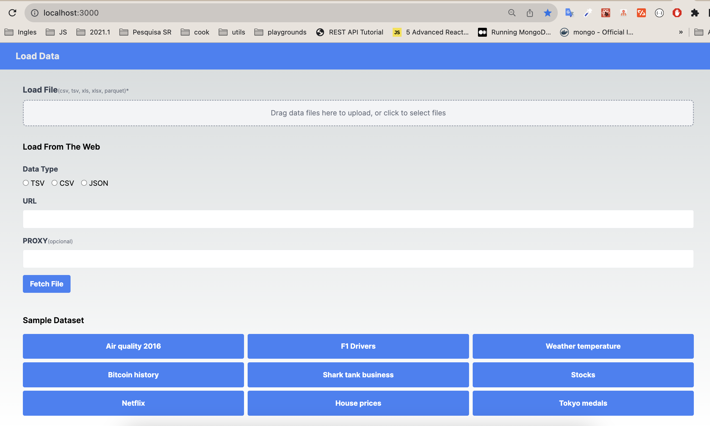
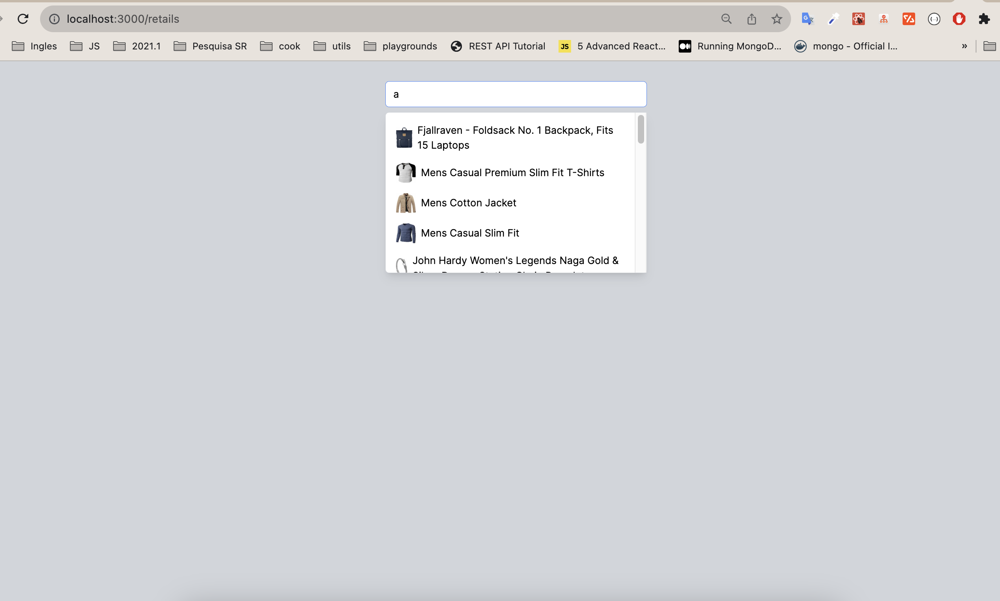

# Load Dataset App

## Overview

This is a sample application for loading datasets using [Next.js](https://nextjs.org/), a React framework. It provides functionality for uploading and processing datasets with various formats.
Also, this project has an additional example of a search bar that filter and display the results (images + title). It can be found in [http://localhost:3000/retails](http://localhost:3000/retails)



## Getting Started

### Prerequisites

Make sure you have Node.js and npm (Node Package Manager) installed on your system.

- Node.js: [Download](https://nodejs.org/)
- npm: (Comes bundled with Node.js)

### Installation

1. Clone this repository:

   ```bash
   git clone <repository-url>
   ```

2. Change to the project directory:

   ```bash
   cd load-dataset-app
   ```

3. Install dependencies:

   ```bash
   npm install
   ```

## Usage

### Development Server

To run the development server:

```bash
npm run dev
```

The development server will start, and you can access the Reference 1 exercise at [http://localhost:3000](http://localhost:3000).

Also, you can access the Reference 1 exercise at [http://localhost:3000/retails](http://localhost:3000/retails).

### Building

To build the application for production:

```bash
npm run build
```

### Starting in Production Mode

To start the application in production mode:

```bash
npm start
```

### Linting

To run linting checks:

```bash
npm run lint
```

## Dependencies

- [Next.js](https://nextjs.org/): Latest version
- [React](https://reactjs.org/): Latest version
- [React DOM](https://reactjs.org/): Latest version

## Development Dependencies

- [@types/node](https://www.npmjs.com/package/@types/node): Latest version
- [@types/react](https://www.npmjs.com/package/@types/react): Latest version
- [@types/react-dom](https://www.npmjs.com/package/@types/react-dom): Latest version
- [autoprefixer](https://www.npmjs.com/package/autoprefixer): Latest version
- [eslint](https://www.npmjs.com/package/eslint): Latest version
- [eslint-config-next](https://www.npmjs.com/package/eslint-config-next): Latest version
- [postcss](https://www.npmjs.com/package/postcss): Latest version
- [tailwindcss](https://www.npmjs.com/package/tailwindcss): Latest version
- [typescript](https://www.npmjs.com/package/typescript): Latest version

## License

This project is licensed under the MIT License - see the [LICENSE](LICENSE) file for details.

## Acknowledgments

- [Next.js](https://nextjs.org/)
- [React](https://reactjs.org/)

## Contributing

Contributions, issues, and feature requests are welcome! Feel free to create issues or pull requests on the [repository](repository-url).

Thank you for using Load Dataset App!
